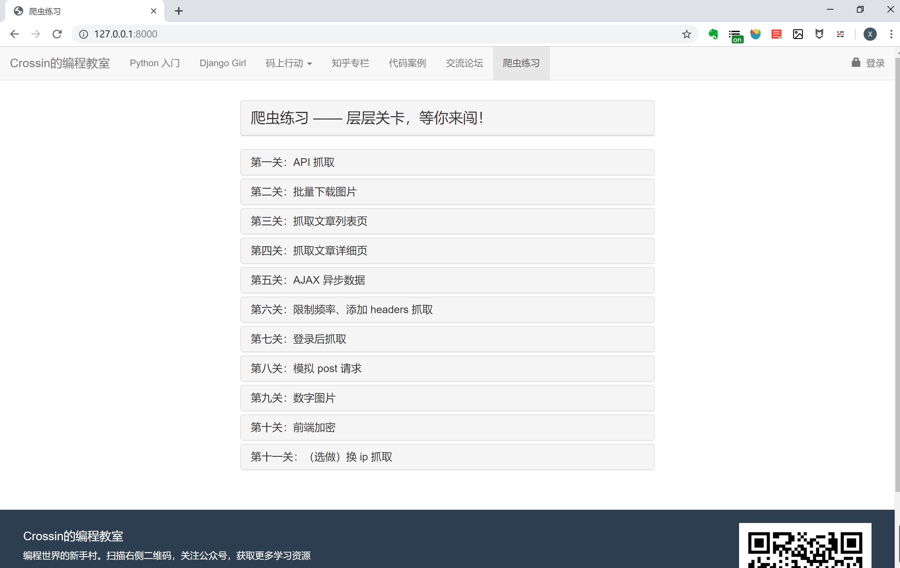

## 爬虫练习

#### 运行环境

* python 3.5, 3.6, 3.7

* Django==2.1.5

* django-tinymce4-lite==1.7.5

#### 运行方法
0. 运行项目前，需要安装 python 3.5, 3.6, 3.7 中的一个；
1. 下载项目到本地并保存在合适位置；
2. （可选）新建一个虚拟环境，在虚拟环境中完成步骤 3 和 4；
3. 通过 pip install Django==2.1.5，pip install django-tinymce4-lite==1.7.5 安装必须的第三方库；
4. 在命令提示符中，进入项目主目录（文件夹 web_crawler_task/ 中），通过 python manage.py runserver 运行项目，如果看到类似下图的界面，说明项目运行成功；

5. 项目运行成功后，在浏览器中打开网址：[http://127.0.0.1:8000/](http://127.0.0.1:8000/)，看到如下图的网页，就可以按照关卡任务，开始爬虫抓取练习；

#### 任务说明
共分十一个任务，分别是：

* 第一关：抓取 API
* 第二关：批量下载图片
* 第三关：抓取文章列表页
* 第四关：抓取文章详细页
* 第五关：AJAX 异步数据获取
* 第六关：限制频率、添加 headers 抓取
* 第七关：登录后抓取
* 第八关：模拟 post 请求
* 第九关：数字图片
* 第十关：前端加密
* 第十一关：（选做）换 ip 抓取

#### 项目实现

##### 后端：
* 采用基于 Python 的 Django 框架实现。
* 用户登录采用 Django 自带的用户登录系统，没有自己写后端登录代码。
* 限制用户访问频率在中间件 middleware 中完成。
* 判断用户是否带有 headers 信息的方法在具体的 views.py 中。

##### 前端：
* 样式采用 bootstrap，并有少部分 js 代码。
* 第五关中，利用了 AJAX 去获得异步数据。
* 数字图片 关卡中，采用了自定义的字体实现加密效果。
* 前端加密 关卡中，对后端加密过的数据利用 JS 解密后显示，并对解密用的 JS 进行了混淆。

##### 数据库：
* 采用 Django 自带的 sqlite3 数据库。
* 共四张表，其中两张包括了需要抓取的文章和教程的数据；第三张表为 IP 表，记录了用户访问次数和时间，用于封禁过多访问的 IP；第四张表用于记录关卡信息。

#### 参数修改

* tasks/middleware/restrict_frequency.py 的开头位置，包括了每次访问需要间隔的时间、规定时间内可以访问的次数和封 IP 的封禁时长，可以根据需要修改；

* tasks/views.py 中，变量 UA_LIST 包括了被验证的 user-agent，可以根据需要修改；

* tasks/views.py 中的变量 ENCODE_LIST 在关卡 数字图片 中被用到，需要配合前端的字体文件一起修改；

* tasks/views.py 中的函数 web_encode()，包括了关卡 前端加密 中需要用到的参数，可以配合前端 JS 代码共同修改。
